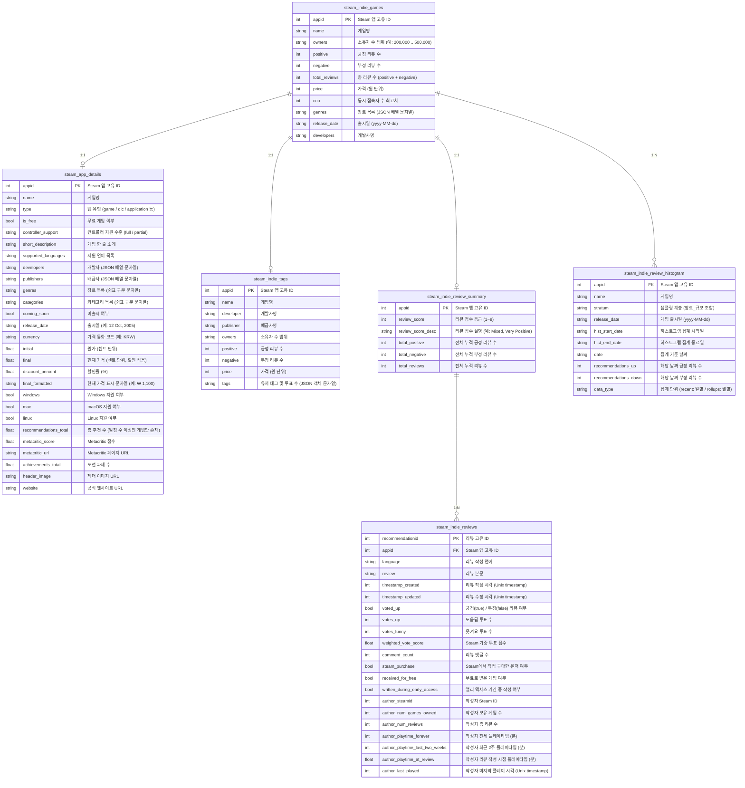

```mermaid
erDiagram
    steam_indie_games {
        int     appid               PK  "Steam 앱 고유 ID"
        string  name                    "게임명"
        string  owners                  "소유자 수 범위 (예: 200,000 .. 500,000)"
        int     positive                "긍정 리뷰 수"
        int     negative                "부정 리뷰 수"
        int     total_reviews           "총 리뷰 수 (positive + negative)"
        int     price                   "가격 (원 단위)"
        int     ccu                     "동시 접속자 수 최고치"
        string  genres                  "장르 목록 (JSON 배열 문자열)"
        string  release_date            "출시일 (yyyy-MM-dd)"
        string  developers              "개발사명"
    }

    steam_app_details {
        int     appid                   PK  "Steam 앱 고유 ID"
        string  name                        "게임명"
        string  type                        "앱 유형 (game / dlc / application 등)"
        bool    is_free                     "무료 게임 여부"
        string  controller_support          "컨트롤러 지원 수준 (full / partial)"
        string  short_description           "게임 한 줄 소개"
        string  supported_languages         "지원 언어 목록"
        string  developers                  "개발사 (JSON 배열 문자열)"
        string  publishers                  "배급사 (JSON 배열 문자열)"
        string  genres                      "장르 목록 (쉼표 구분 문자열)"
        string  categories                  "카테고리 목록 (쉼표 구분 문자열)"
        bool    coming_soon                 "미출시 여부"
        string  release_date               "출시일 (예: 12 Oct, 2005)"
        string  currency                    "가격 통화 코드 (예: KRW)"
        float   initial                     "원가 (센트 단위)"
        float   final                       "현재 가격 (센트 단위, 할인 적용)"
        float   discount_percent            "할인율 (%)"
        string  final_formatted             "현재 가격 표시 문자열 (예: ₩ 1,100)"
        bool    windows                     "Windows 지원 여부"
        bool    mac                         "macOS 지원 여부"
        bool    linux                       "Linux 지원 여부"
        float   recommendations_total       "총 추천 수 (일정 수 이상인 게임만 존재)"
        float   metacritic_score            "Metacritic 점수"
        string  metacritic_url              "Metacritic 페이지 URL"
        float   achievements_total          "도전 과제 수"
        string  header_image                "헤더 이미지 URL"
        string  website                     "공식 웹사이트 URL"
    }

    steam_indie_tags {
        int     appid               PK  "Steam 앱 고유 ID"
        string  name                    "게임명"
        string  developer               "개발사명"
        string  publisher               "배급사명"
        string  owners                  "소유자 수 범위"
        int     positive                "긍정 리뷰 수"
        int     negative                "부정 리뷰 수"
        int     price                   "가격 (원 단위)"
        string  tags                    "유저 태그 및 투표 수 (JSON 객체 문자열)"
    }

    steam_indie_review_summary {
        int     appid               PK  "Steam 앱 고유 ID"
        int     review_score            "리뷰 점수 등급 (1~9)"
        string  review_score_desc       "리뷰 점수 설명 (예: Mixed, Very Positive)"
        int     total_positive          "전체 누적 긍정 리뷰 수"
        int     total_negative          "전체 누적 부정 리뷰 수"
        int     total_reviews           "전체 누적 리뷰 수"
    }

    steam_indie_review_histogram {
        int     appid               FK  "Steam 앱 고유 ID"
        string  name                    "게임명"
        string  stratum                 "샘플링 계층 (장르_규모 조합)"
        string  release_date            "게임 출시일 (yyyy-MM-dd)"
        string  hist_start_date         "히스토그램 집계 시작일"
        string  hist_end_date           "히스토그램 집계 종료일"
        string  date                    "집계 기준 날짜"
        int     recommendations_up      "해당 날짜 긍정 리뷰 수"
        int     recommendations_down    "해당 날짜 부정 리뷰 수"
        string  data_type               "집계 단위 (recent: 일별 / rollups: 월별)"
    }

    steam_indie_reviews {
        int     recommendationid    PK  "리뷰 고유 ID"
        int     appid               FK  "Steam 앱 고유 ID"
        string  language                "리뷰 작성 언어"
        string  review                  "리뷰 본문"
        int     timestamp_created       "리뷰 작성 시각 (Unix timestamp)"
        int     timestamp_updated       "리뷰 수정 시각 (Unix timestamp)"
        bool    voted_up                "긍정(true) / 부정(false) 리뷰 여부"
        int     votes_up                "도움됨 투표 수"
        int     votes_funny             "웃겨요 투표 수"
        float   weighted_vote_score     "Steam 가중 투표 점수"
        int     comment_count           "리뷰 댓글 수"
        bool    steam_purchase          "Steam에서 직접 구매한 유저 여부"
        bool    received_for_free       "무료로 받은 게임 여부"
        bool    written_during_early_access "얼리 액세스 기간 중 작성 여부"
        int     author_steamid          "작성자 Steam ID"
        int     author_num_games_owned  "작성자 보유 게임 수"
        int     author_num_reviews      "작성자 총 리뷰 수"
        int     author_playtime_forever "작성자 전체 플레이타임 (분)"
        int     author_playtime_last_two_weeks "작성자 최근 2주 플레이타임 (분)"
        float   author_playtime_at_review "작성자 리뷰 작성 시점 플레이타임 (분)"
        int     author_last_played      "작성자 마지막 플레이 시각 (Unix timestamp)"
    }

    steam_indie_games       ||--o| steam_indie_review_summary   : "1:1"
    steam_indie_games       ||--o{ steam_indie_review_histogram : "1:N"
    steam_indie_games       ||--o| steam_indie_tags             : "1:1"
    steam_indie_games       ||--o| steam_app_details            : "1:1"
    steam_indie_review_summary ||--o{ steam_indie_reviews : "1:N"
```
