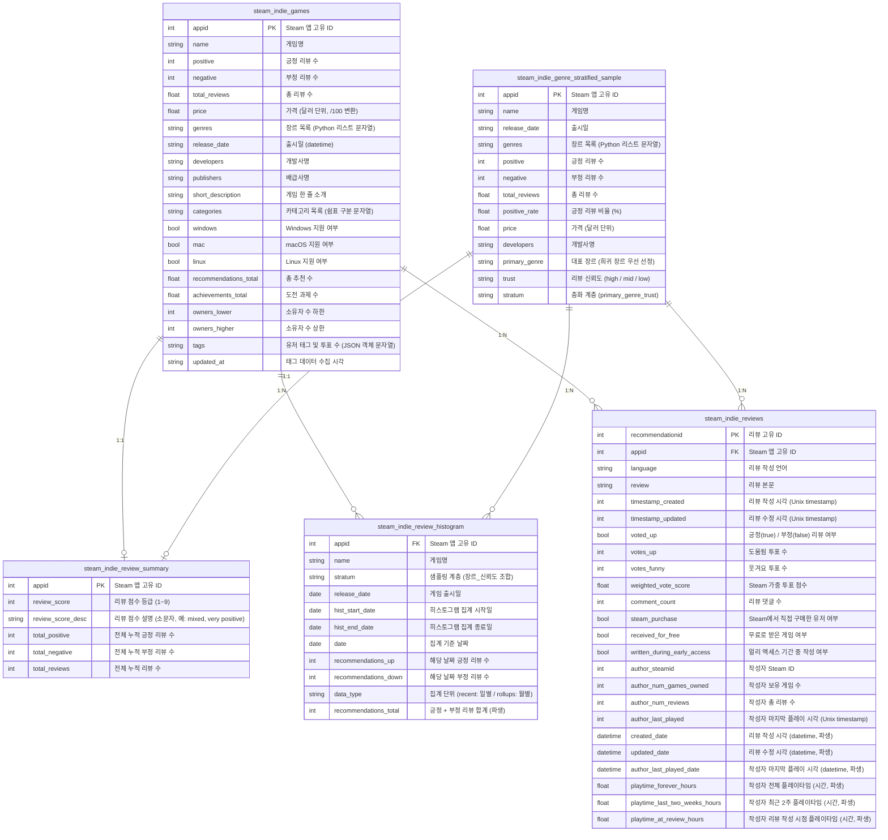

```mermaid
erDiagram
    steam_indie_games {
        int     appid                   PK  "Steam 앱 고유 ID"
        string  name                        "게임명"
        int     positive                    "긍정 리뷰 수"
        int     negative                    "부정 리뷰 수"
        float   total_reviews               "총 리뷰 수"
        float   price                       "가격 (달러 단위, /100 변환)"
        string  genres                      "장르 목록 (Python 리스트 문자열)"
        string  release_date                "출시일 (datetime)"
        string  developers                  "개발사명"
        string  publishers                  "배급사명"
        string  short_description           "게임 한 줄 소개"
        string  categories                  "카테고리 목록 (쉼표 구분 문자열)"
        bool    windows                     "Windows 지원 여부"
        bool    mac                         "macOS 지원 여부"
        bool    linux                       "Linux 지원 여부"
        float   recommendations_total       "총 추천 수"
        float   achievements_total          "도전 과제 수"
        int     owners_lower                "소유자 수 하한"
        int     owners_higher               "소유자 수 상한"
        string  tags                        "유저 태그 및 투표 수 (JSON 객체 문자열)"
        string  updated_at                  "태그 데이터 수집 시각"
    }

    steam_indie_genre_stratified_sample {
        int     appid                   PK  "Steam 앱 고유 ID"
        string  name                        "게임명"
        string  release_date                "출시일"
        string  genres                      "장르 목록 (Python 리스트 문자열)"
        int     positive                    "긍정 리뷰 수"
        int     negative                    "부정 리뷰 수"
        float   total_reviews               "총 리뷰 수"
        float   positive_rate               "긍정 리뷰 비율 (%)"
        float   price                       "가격 (달러 단위)"
        string  developers                  "개발사명"
        string  primary_genre               "대표 장르 (희귀 장르 우선 선정)"
        string  trust                       "리뷰 신뢰도 (high / mid / low)"
        string  stratum                     "층화 계층 (primary_genre_trust)"
    }

    steam_indie_review_summary {
        int     appid               PK  "Steam 앱 고유 ID"
        int     review_score            "리뷰 점수 등급 (1~9)"
        string  review_score_desc       "리뷰 점수 설명 (소문자, 예: mixed, very positive)"
        int     total_positive          "전체 누적 긍정 리뷰 수"
        int     total_negative          "전체 누적 부정 리뷰 수"
        int     total_reviews           "전체 누적 리뷰 수"
    }

    steam_indie_review_histogram {
        int     appid               FK  "Steam 앱 고유 ID"
        string  name                    "게임명"
        string  stratum                 "샘플링 계층 (장르_신뢰도 조합)"
        date    release_date            "게임 출시일"
        date    hist_start_date         "히스토그램 집계 시작일"
        date    hist_end_date           "히스토그램 집계 종료일"
        date    date                    "집계 기준 날짜"
        int     recommendations_up      "해당 날짜 긍정 리뷰 수"
        int     recommendations_down    "해당 날짜 부정 리뷰 수"
        string  data_type               "집계 단위 (recent: 일별 / rollups: 월별)"
        int     recommendations_total   "긍정 + 부정 리뷰 합계 (파생)"
    }

    steam_indie_reviews {
        int     recommendationid        PK  "리뷰 고유 ID"
        int     appid                   FK  "Steam 앱 고유 ID"
        string  language                    "리뷰 작성 언어"
        string  review                      "리뷰 본문"
        int     timestamp_created           "리뷰 작성 시각 (Unix timestamp)"
        int     timestamp_updated           "리뷰 수정 시각 (Unix timestamp)"
        bool    voted_up                    "긍정(true) / 부정(false) 리뷰 여부"
        int     votes_up                    "도움됨 투표 수"
        int     votes_funny                 "웃겨요 투표 수"
        float   weighted_vote_score         "Steam 가중 투표 점수"
        int     comment_count               "리뷰 댓글 수"
        bool    steam_purchase              "Steam에서 직접 구매한 유저 여부"
        bool    received_for_free           "무료로 받은 게임 여부"
        bool    written_during_early_access "얼리 액세스 기간 중 작성 여부"
        int     author_steamid              "작성자 Steam ID"
        int     author_num_games_owned      "작성자 보유 게임 수"
        int     author_num_reviews          "작성자 총 리뷰 수"
        int     author_last_played          "작성자 마지막 플레이 시각 (Unix timestamp)"
        datetime created_date               "리뷰 작성 시각 (datetime, 파생)"
        datetime updated_date               "리뷰 수정 시각 (datetime, 파생)"
        datetime author_last_played_date    "작성자 마지막 플레이 시각 (datetime, 파생)"
        float   playtime_forever_hours      "작성자 전체 플레이타임 (시간, 파생)"
        float   playtime_last_two_weeks_hours "작성자 최근 2주 플레이타임 (시간, 파생)"
        float   playtime_at_review_hours    "작성자 리뷰 작성 시점 플레이타임 (시간, 파생)"
    }

    steam_indie_games                  ||--o| steam_indie_review_summary      : "1:1"
    steam_indie_games                  ||--o{ steam_indie_review_histogram    : "1:N"
    steam_indie_games                  ||--o{ steam_indie_reviews             : "1:N"
    steam_indie_genre_stratified_sample ||--o| steam_indie_review_summary    : "1:1"
    steam_indie_genre_stratified_sample ||--o{ steam_indie_review_histogram  : "1:N"
    steam_indie_genre_stratified_sample ||--o{ steam_indie_reviews           : "1:N"
```
